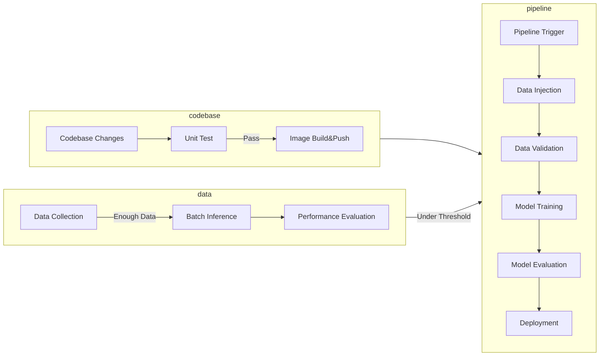

# Complete MLOps System Workflow with TFX

This repository shows how to build a complete MLOps system with [TensorFlow eXtended(TFX)](https://www.tensorflow.org/tfx) and various GCP products such as [Vertex Pipeline](https://cloud.google.com/vertex-ai/docs/pipelines), [Vertex Training](https://cloud.google.com/vertex-ai/docs/training/custom-training), [Vertex Endpoint](https://cloud.google.com/vertex-ai/docs/predictions/deploy-model-api), [Google Cloud Storage](https://cloud.google.com/products/storage/), [Cloud Scheduler](https://cloud.google.com/scheduler), [Cloud Function](https://cloud.google.com/functions), and [Cloud Build](https://cloud.google.com/build). The main goal is to achieve the two common scenarios of **adapting to changes in codebase** and **adapting to changes in data** over time. To achieve these, we need three separate pipelines:

- Traditional CI/CD pipeline
  - This pipeline is implemented in GitHub Action and Cloud Build.
- Data evaluation pipeline (TFX Pipeline)
  - This pipeline is implemented in TFX, Vertex Pipeline, Vertex Batch Inferencing, Cloud Function, and Cloud Scheduler.
- Machine learning pipeline (TFX Pipeline)
  - This pipeline is implemented in TFX, Vertex Pipeline, Vertex Training, Vertex Endpoint.

**👋 NOTE**: One could argue the whole component can be implemented without any cloud services. However, in my opinion, it is non trivial to achieve production ready quality of MLOps system without any help of cloud services. 
