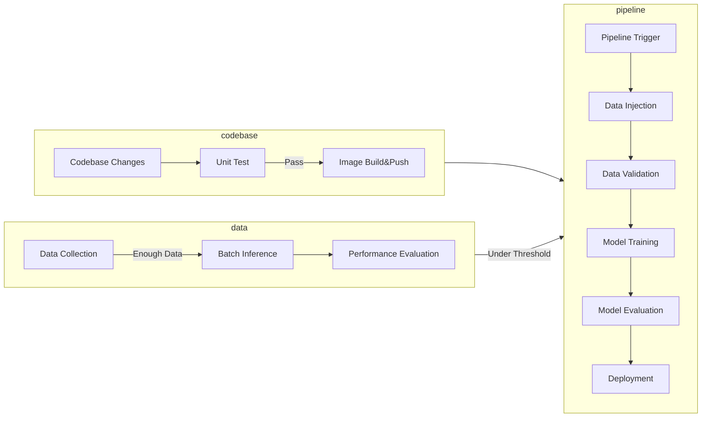

# Complete MLOps System Workflow with TFX

This repository consists of two main MLOps workflows in the context of image classification task. 
1. Adapting to changes in codebase
2. Adapting to changes in data

